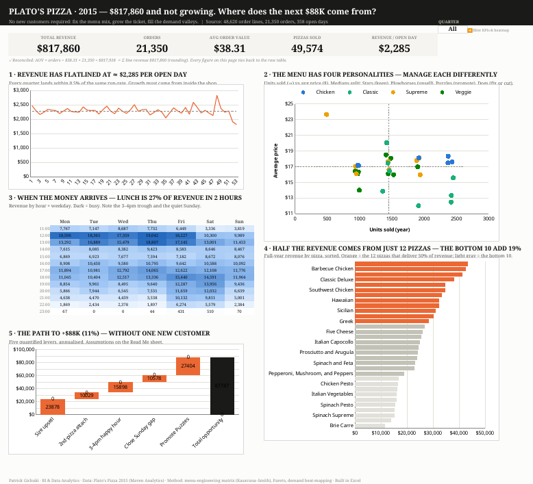

# 🍕 Plato's Pizza — From a Descriptive Dashboard to a Decision Dashboard

**An Excel BI project: one governing question, five quantified levers, +$88K identified.**



## The story

A year of pizza-shop transactions (48,620 order lines, 21,350 orders, $817,860 revenue)
looks healthy — until you normalise by open days and see that **revenue is completely
flat**: every quarter of 2015 ran at ≈ $2,285 per open day, within 0.5% of the same
run-rate. This project reframes the standard "pizza sales dashboard" around the question
that actually matters to the owner:

> **Revenue hasn't grown all year. Where does the next $88K come from — without a
> single new customer?**

The answer, quantified from the transaction data:

| Lever | Basis | Annual gain |
|---|---|---:|
| Size upsell | 1-in-5 orders upgraded one size (~$4/step price ladder) | +$23.9K |
| Second-pizza attach | 10% of 8,111 single-pizza orders add a small | +$10.0K |
| 3–4pm happy hour | +30% on the trough (currently 47% of the lunch peak) | +$15.9K |
| Close the Sunday gap | Recover 25% of the Fri–Sun gap ($2,721 vs $1,908/day) | +$10.6K |
| Promote the "Puzzles" | +15% volume on 9 premium-but-invisible pizzas | +$27.4K |
| **Total** | | **≈ +$88K (+11%)** |

Full analysis: **[report/REPORT.md](report/REPORT.md)**

## What's in the dashboard

`dashboard/Pizza_Sales_Dashboard.xlsx` — a single-screen, story-ordered Excel dashboard:

1. **The plateau** — weekly revenue per open day against the flat year average
2. **Menu engineering matrix** — every pizza plotted by popularity × price
   (Kasavana–Smith quadrants: Stars / Plowhorses / Puzzles / Dogs), medians as guide lines
3. **Demand heatmap** — revenue by hour × weekday via conditional formatting
   (lunch = 27% of revenue in 2 hours; the 3–4pm trough; the quiet Sunday)
4. **Revenue concentration** — 12 of 32 pizzas earn half the revenue; the bottom 10 add 19%
5. **Opportunity waterfall** — the five levers stacked to the +$88K total

Plus: KPI cards with a **quarter selector** (SUMIFS-driven, wildcard-aware), a visible
**reconciliation footnote** (AOV × orders ties to summed line revenue), and a **Read Me
sheet** documenting every helper column, assumption and data-quality finding.

## Analytical choices worth noting

- **Normalise before you conclude.** Raw monthly revenue looks noisy; per-open-day
  revenue exposes the plateau (the shop was closed 7 days, including four consecutive
  October Mondays — found by checking the calendar, not the pivot).
- **"Worst seller" is the wrong lens.** The Brie Carre is the priciest pizza on the menu
  ($23.65) and the least ordered (490 units). A bottom-5 bar chart says *cut it*; the
  menu-engineering matrix says *it's under-promoted premium* — opposite actions.
- **Distinct counts without a data model:** first-occurrence flags (`OrderFlag`,
  `DateFlag`) turn SUMIFS into distinct order/day counts.
- **Design follows *Storytelling with Data*:** action titles state findings, one accent
  colour carries the story, no pies / 3-D / dual value axes; the categorical palette is
  colour-blind-safe (validated, worst adjacent ΔE 24.2).
- **Accounting discipline:** every headline figure reconciles back to the raw table —
  which is also how a 10× error in a headline KPI gets caught before it ships.

## Repository layout

```
├── dashboard/Pizza_Sales_Dashboard.xlsx   # the Excel dashboard (open in Excel, enable editing)
├── report/REPORT.md                       # full written analysis
│   └── figures/                           # report charts
├── data/pizza_sales.csv                   # source data (Maven Analytics pizza challenge)
├── docs/                                  # dashboard preview + original baseline dashboard
└── scripts/                               # Python: workbook builder + figure generation
    ├── build_workbook.py                  #   reproducible openpyxl build of the .xlsx
    └── gen_figures.py                     #   matplotlib report figures
```

The workbook is native Excel — formulas, charts, conditional formatting, data validation —
and its construction is scripted with `openpyxl` so the entire artifact is reproducible
from raw data (`python3 scripts/build_workbook.py` from the repo root).

## Context

Built as a mentorship challenge: improve on a baseline descriptive dashboard
([docs/mentor_dashboard.jpeg](docs/mentor_dashboard.jpeg)) in analytics, design and
storytelling. The baseline answers *"what sold?"*; this project answers *"what should we
do, and what is it worth?"*


---

## 👤 Author

**Analyst:** Patrick Mwangi Gichuki
**Portfolio:** [https://gichuki.site](https://gichuki.site)
**LinkedIn:** [https://www.linkedin.com/in/patrick-gichuki-the-bi-analyst](https://www.linkedin.com/in/patrick-gichuki-the-bi-analyst)
