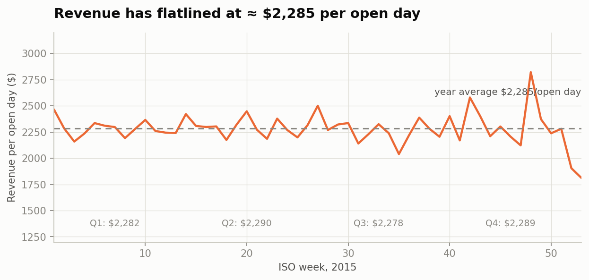
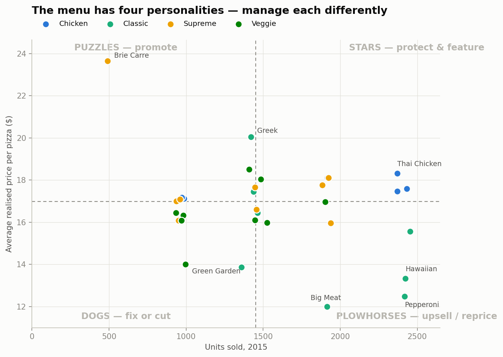
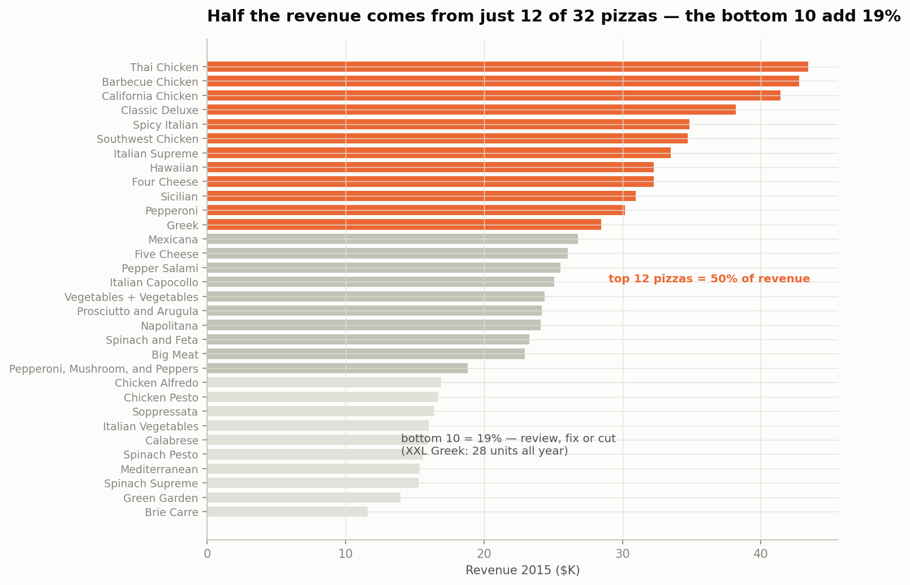
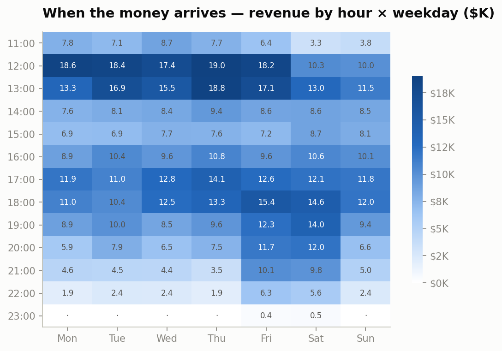
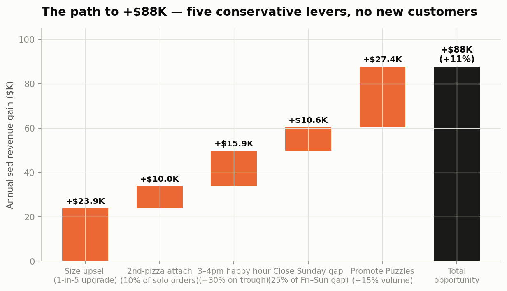

# Plato's Pizza 2015 — The Flat-Revenue Diagnosis and the +$88K Recovery Plan

**Author:** Patrick Gichuki · BI & Data Analyst
**Data:** 48,620 order lines · 21,350 orders · 358 open days · full year 2015
**Tools:** Excel (dashboard), Python (validation & figures)

---

## Executive summary (the answer first)

Plato's Pizza earned **$817,860** in 2015 — and did not grow. Revenue per open day was
$2,282 in Q1, $2,290 in Q2, $2,278 in Q3 and $2,289 in Q4: a four-quarter plateau within
0.5% of the same run-rate. Growth therefore has to come from inside the shop, and the
transaction data shows exactly where. **Five conservative levers — none of which require a
single new customer — are worth ≈ $88K a year, an 11% uplift:**

| # | Lever | Assumption | Annual gain |
|---|-------|------------|------------:|
| 1 | Size upsell | 1 in 5 orders upgraded one size (observed price ladder ≈ $4/step) | **+$23.9K** |
| 2 | Second-pizza attach | 10% of the 8,111 single-pizza orders add one small pizza | **+$10.0K** |
| 3 | 3–4pm happy hour | +30% on the mid-afternoon trough (currently 47% of the lunch peak) | **+$15.9K** |
| 4 | Close the Sunday gap | Recover 25% of the Friday–Sunday gap ($2,721 vs $1,908/day) | **+$10.6K** |
| 5 | Promote the "Puzzles" | +15% volume on 9 premium-but-invisible pizzas | **+$27.4K** |
|   | **Total opportunity** | | **≈ +$88K (+11%)** |

The analysis below explains each conclusion; a menu-engineering matrix, a demand heatmap
and a revenue-concentration view carry the diagnosis.

---

## 1 · The situation: a revenue plateau

Normalising by *open* days (the shop was closed 7 days in 2015) removes calendar noise
and makes the pattern unambiguous: weekly revenue oscillates around $2,285/day with no
trend. Seasonality is mild (July is the best month at $72.6K, October the worst at $64.0K),
and the average order value is stable at $38 all year. Nothing in the trading calendar is
driving growth — so the menu, the ticket and the clock have to.

## 2 · Diagnosis A: the menu has four personalities

A Kasavana–Smith menu-engineering matrix plots each of the 32 pizzas by popularity
(units sold) and average realised price (a contribution proxy — ingredient costs are not in
the data). Split at the medians (1,452 units / $16.99), four groups emerge, each with a
different playbook:

- **Stars (7)** — popular *and* premium. All the chicken-led pizzas (Thai, BBQ, California,
  Southwest) plus Spicy Italian, Italian Supreme, Mexicana. Protect placement, never
  discount, feature in marketing.
- **Plowhorses (9)** — popular but cheap. Classic Deluxe, Hawaiian, Pepperoni ($12.47
  average — the cheapest big seller), Big Meat. These carry volume; a modest price rise or
  bundle is worth far more here than anywhere else.
- **Puzzles (9)** — premium but invisible. The Brie Carre is the **most expensive pizza on
  the menu ($23.65) and the least ordered (490 units)**. A "worst-sellers" chart calls this a
  failure; the matrix says it is an under-promoted premium product. Feature, sample, and
  reposition before considering removal.
- **Dogs (7)** — cheap and unpopular: the spinach/veggie cluster (Spinach Pesto, Spinach
  Supreme, Green Garden, Mediterranean…). Re-recipe, reprice, or retire.

## 3 · Diagnosis B: revenue is concentrated — and the tail is long

Twelve pizzas (37% of the menu) generate half of all revenue; the bottom ten generate 19%.
At SKU level (pizza × size) the tail is worse: of 91 SKUs, the XXL Greek sold **28 units in an
entire year**, the L Green Garden 95, the S Chicken Alfredo 96. Every dead SKU costs
ingredient stock, menu space and kitchen complexity while contributing almost nothing.
The recommendation is not "cut the bottom of the menu" — several low-volume pizzas are
high-price Puzzles — it is **manage by quadrant, and prune the dead sizes**.

## 4 · Diagnosis C: demand is a schedule, not a mystery

- **Lunch is the business:** 12:00–14:00 delivers 26.6% of annual revenue in 2 of 15
  trading hours — and lunch orders are bigger (2.65 pizzas, $43.81) than dinner orders
  (2.23 pizzas, $36.80). Staffing and oven capacity should be planned around this spike.
- **The 3–4pm trough** runs at 47% of the lunch peak — the natural home for a
  happy-hour or office-deal promotion.
- **Friday earns $2,721/day; Sunday $1,908** — a 43% gap and the cheapest demand to
  recover, because the shop is already open and staffed.
- The heatmap starts at 11:00: the 9am and 10am hours produced 9 orders *all year* and
  are candidates for a later opening time (a cost lever this data can't quantify).

## 5 · Prescription: the path to +$88K

Each lever is deliberately conservative and each maps to an owner: the size upsell and
second-pizza attach are counter scripts (train staff, measure weekly); the happy hour and
Sunday promotions are marketing calendar items; the Puzzle promotion is a menu-design
change. Together they are worth **≈ $87.8K a year — an 11% uplift with zero customer
acquisition cost.**

---

## Reconciliation & data quality (the accounting habit)

- **Tie-out:** Σ line revenue = $817,860.05. Cross-check: AOV $38.31 × 21,350 orders =
  $817,918 (difference is rounding in the displayed AOV). Pizzas sold = Σ quantity = 49,574.
- **Calendar:** 358 open days. The 7 closed days: 24–25 Sep, four consecutive Mondays in
  October (5, 12, 19, 26 Oct), and 25 Dec — a pattern worth confirming with the owner
  (planned closures vs missing data).
- **Menu structure quirks:** XL and XXL exist only in the Classic category; the Brie Carre
  is the only small-only pizza.
- **Limitations:** one year of data (no year-over-year trend possible); no ingredient
  costs (price is used as a contribution proxy); no customer identifiers (no repeat-rate or
  retention analysis); lever estimates are scenario arithmetic, not experiments — each
  should be piloted and measured.

## Method note

Analysis performed on the raw transaction table (`data/pizza_sales.csv`). The Excel
workbook (`dashboard/Pizza_Sales_Dashboard.xlsx`) contains the same logic implemented
with native formulas: helper columns documented on its *Read Me* sheet, distinct counts
via first-occurrence flags, quarter filtering via SUMIFS, and the five visuals above rebuilt
as native Excel charts. Chart palette is colour-blind-safe (validated: worst adjacent
ΔE 24.2; sequential ramp single-hue). Design follows *Storytelling with Data*: action
titles state the finding, one accent colour carries the story, and no pies, 3-D effects or
dual value axes are used.
